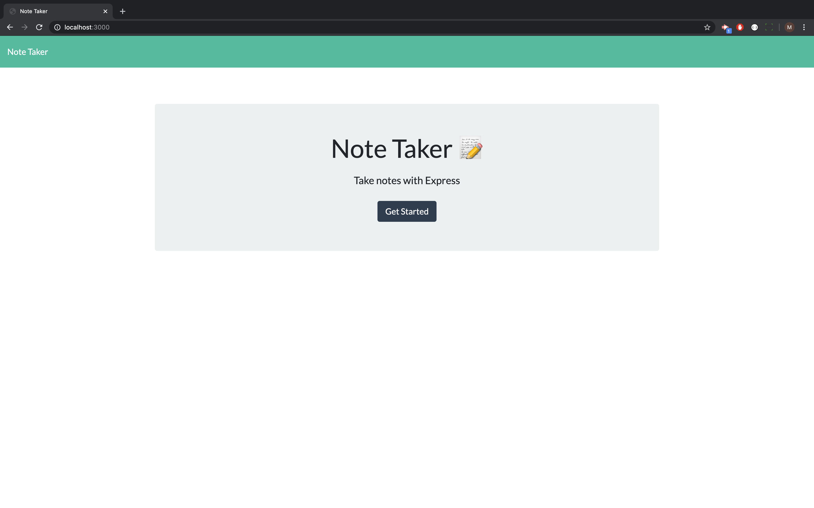
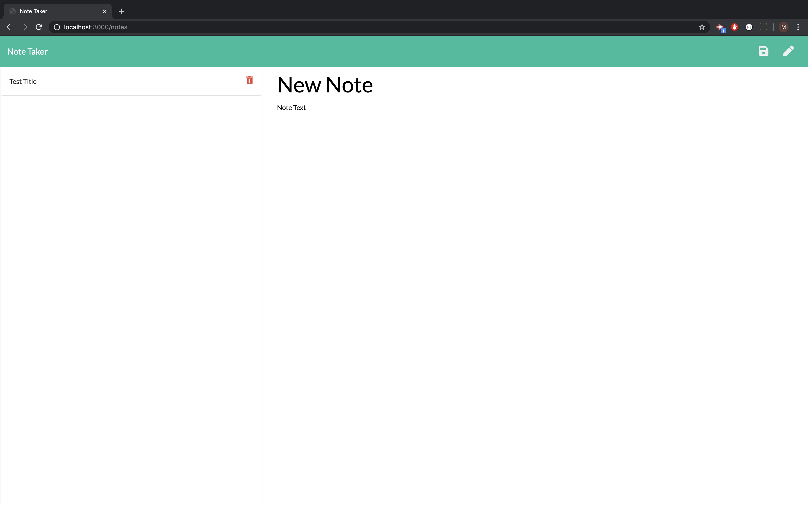
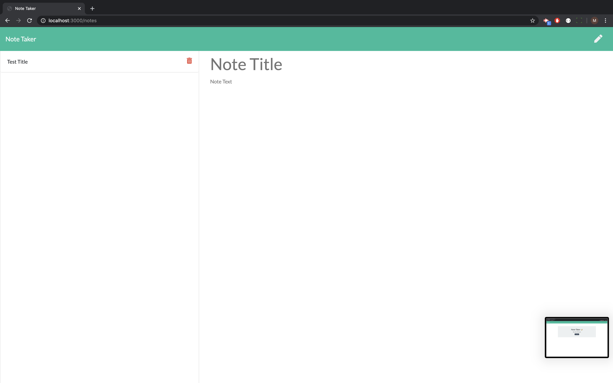
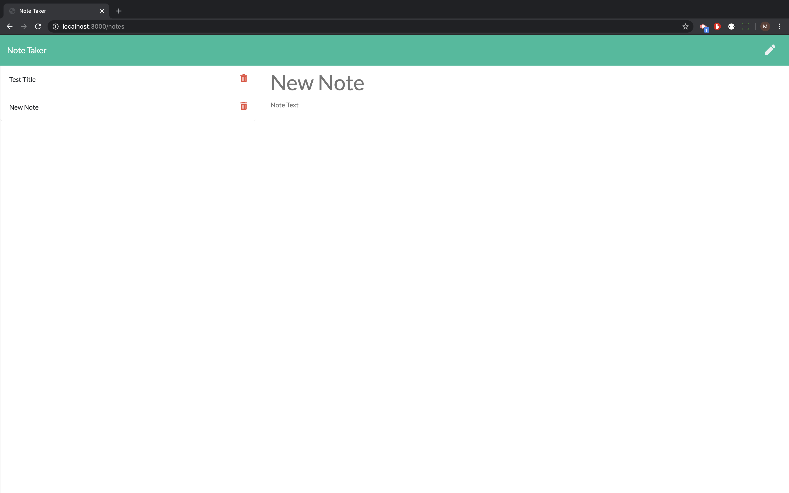

# Note Taker

# **Project Description**
For this project I built an note taking application. I used an express backend to save and retrieve note data from a JSON database. 

# **Screencaps:**

# **Demo Video:**
[https://drive.google.com/file/d/1NzbxGdJN0Fawj2sG9XTBcikG1f2O3XWR/view]

# **Installation**
Download the zip file and unzip it. Open the files and run npm install to intall the required dependencies. Then run npm start and navigate to http://localhost/3000 to use the application.

# **Technology Stack**
* HTML 
* CSS
* JavaScript
* Bootstrap
* JSON
* Express

# **Contact**
* ### **Name:**  Morgan Splawn
* ### **Github:**  [@msplawn](https://github.com/msplawn)
* ### **Email:**  [mmsplawn@gmail.com](msplawn@gmail.com)
* ### **LinkedIn:**  [https://www.linkedin.com/in/morgan-splawn-72979a1a9/](https://www.linkedin.com/in/morgan-splawn-72979a1a9/)
